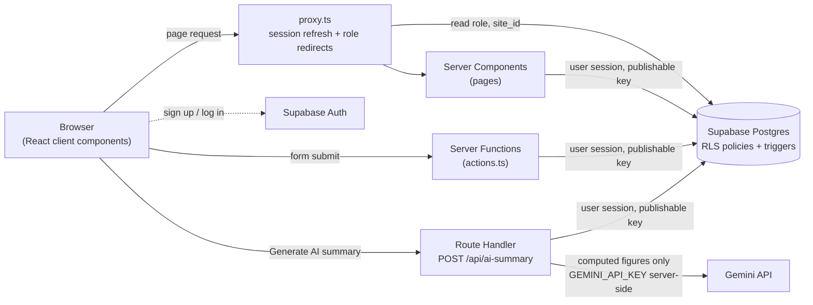

# EnerTrack

## Overview

EnerTrack is a web app for tracking the energy consumption of several sites (electricity, gas, fuel, water). Site Managers enter readings for their own site. Energy Managers and Direction follow every site. An AI summary explains the month's figures in plain English.

Live: https://enertrack-psi.vercel.app

Access control is enforced in the database with Postgres Row Level Security, not only in the UI.

## Features

- **Authentication**: sign-up (email, password, full name), login and logout with Supabase Auth. A new account is always a Site Manager without a site.
- **Pending screen**: a Site Manager without an assigned site sees only `/pending` until Direction assigns one.
- **Role-based routing** (`proxy.ts`): each role is redirected to the pages it may open.
- **My Site** (`/my-site`, Site Manager):
  - reading entry form (energy type, value, date);
  - edit (value and date only) and delete for each reading;
  - charts and readings table.
- **Consumption charts**: one chart per energy type (2×2 grid), each with its own axis and unit.
- **AI summary**: a "Generate AI summary" button on a site dashboard, plus the list of previous summaries for that site.
- **Sites** (`/sites`, Energy Manager and Direction):
  - site list with status (active / archived), linking to each site's detail page;
  - Direction only: create, edit (name, location, monthly electricity budget) and archive a site. Sites are never deleted.
- **Site detail** (`/sites/[id]`): read-only dashboard with charts, AI summary and readings. A site that does not exist or is not visible returns the same 404.
- **Users** (`/users`, Direction):
  - list of accounts, with a role menu and a site-assignment menu on each row;
  - a clear message when a site already has a Site Manager;
  - you cannot change your own role.
- **Demo data**: `supabase/seed.sql`.
- **Tests**: an RLS attacker script and a unit test for the monthly totals.

Units are fixed per energy type (`lib/energy.ts`): electricity kWh, gas m³, fuel L, water m³.

## Tech stack

| Choice | Why |
|---|---|
| **Next.js 16 (App Router)** | One project for UI and server code. Server Components read data with the user's session, and Server Functions handle writes without a separate API layer. |
| **Supabase (Postgres + Auth) with RLS** | Auth and database in one service. Row Level Security and triggers enforce permissions in Postgres, so they still hold if a client bypasses the UI. |
| **Gemini (`@google/genai`, `gemini-3.8-flash`)** | A Flash model on the free tier, fast enough for a 2–3 sentence summary. It only explains figures that the code has already computed. |
| **Recharts** | React components for charts, with no direct DOM work. They are fed the readings that the page has already loaded. |
| **Tailwind CSS 4** | Utility classes, with no separate stylesheet to maintain. |
| **Vercel** | Native hosting for Next.js. Server-only environment variables (like the Gemini key) stay on the server. |

## Architecture



Security has three layers.

1. **RLS policies** (`002_security.sql`, `003_readings_update.sql`) decide which rows each role can read, insert, update or delete. Every server-side query uses the signed-in user's session and the publishable key. The service-role key is not used anywhere in the app.
2. **Triggers** protect what RLS cannot express at column level:
   - `protect_profile_columns` blocks a non-Direction user from changing `role` or `site_id`;
   - `protect_reading_columns` makes `site_id`, `energy_type` and `created_by` immutable on readings;
   - `handle_new_user` creates the profile row at sign-up.
3. **`proxy.ts`** redirects each role away from pages it may not open, and refreshes the session cookie. It is a UX layer only: if it were removed, RLS would still block the data.

## Roles and permissions

Built from the RLS policies in `002_security.sql`, as amended by `003_readings_update.sql`. "Own site" means the profile's `site_id`.

| Table | Action | Site Manager | Energy Manager | Direction |
|---|---|---|---|---|
| `sites` | Read | Own site | All | All |
| | Create | — | — | Yes (as `created_by`) |
| | Update / archive | — | — | Yes |
| | Delete | — | — | — (no policy: archive instead) |
| `readings` | Read | Own site | All | All |
| | Create | Own site, as `created_by` | — | Any site, as `created_by` |
| | Update | Own site, value and date only | — | Any site, value and date only |
| | Delete | Own site | — | Any site |
| `profiles` | Read | Own row | All | All |
| | Create | — (trigger at sign-up) | — (trigger at sign-up) | — (trigger at sign-up) |
| | Update | Own row, not `role` / `site_id` | Own row, not `role` / `site_id` | All rows, including `role` / `site_id` |
| | Delete | — | — | Yes |
| `ai_summaries` | Read | Own site | All | All |
| | Create | Own site, as `created_by` | Any site, as `created_by` | Any site, as `created_by` |
| | Update | — | — | — (no policy) |
| | Delete | — | — | Yes |

Database constraints also apply:
- one reading per site, energy type and date;
- `value >= 0` and `date <= current_date`;
- one Site Manager per site (a partial unique index on `profiles.site_id`).

## Setup

### Prerequisites

- Node.js 20.9 or later (required by Next.js 16).
- A Supabase project.
- A Gemini API key from Google AI Studio.

### Install

```bash
git clone https://github.com/aymestari-ship-it/enertrack
cd enertrack
npm install
```

### Environment variables

Copy `.env.example` to `.env.local` and fill it in:

```bash
NEXT_PUBLIC_SUPABASE_URL=            # Supabase project URL
NEXT_PUBLIC_SUPABASE_PUBLISHABLE_KEY= # Supabase publishable key (public, RLS applies)
GEMINI_API_KEY=                      # server-only: never prefix with NEXT_PUBLIC_

# Only for npm run test:security: two Site Managers assigned to two different sites
TEST_USER_A_EMAIL=
TEST_USER_A_PASSWORD=
TEST_USER_B_EMAIL=
TEST_USER_B_PASSWORD=
```

`.env.local` is ignored by git.

### Database

In the Supabase SQL Editor, run the migrations in order:

1. `supabase/migrations/001_schema.sql`: tables, constraints, RLS enabled.
2. `supabase/migrations/002_security.sql`: helper functions, policies and triggers.
3. `supabase/migrations/003_readings_update.sql`: fixed `readings_update` policy and the reading-column trigger.

### First Direction account

Public sign-up always creates a Site Manager. To create the first Direction account:

1. Start the app (see below) and sign up at `/signup`.
2. In the SQL Editor, promote that account:

   ```sql
   UPDATE public.profiles
   SET role = 'direction', site_id = NULL
   WHERE id = (SELECT id FROM auth.users WHERE email = 'you@example.com');
   ```

   This works from the SQL Editor because `auth.uid()` is null there, so `protect_profile_columns` does not block it.

### Demo data (optional)

Run `supabase/seed.sql` in the SQL Editor **after** creating the Direction account, because the seed uses it as `created_by`. The seed:
- adds two active sites, "Site D" and "Site E";
- adds daily readings of the 4 energy types over the last 5 months, up to yesterday, for the active sites named "Site A", "Site C", "Site D" and "Site E";
- includes an intended anomaly: Site D's electricity is +30% over the current month.

The seed is re-runnable: existing sites and readings are skipped. It creates no AI summaries.

### Run

```bash
npm run dev
```

Then open http://localhost:3000.

## Tests

| Command | Needs | What it checks |
|---|---|---|
| `npm run test:security` | `.env.local` with the Supabase variables and the two `TEST_USER_*` accounts | See below. |
| `npm run test:totals` | nothing (no network, no database) | See below. |

**`npm run test:security`** plays an attacker. It signs in as Site Manager A with `supabase-js` and the publishable key, like a real client, and runs 17 checks:
- A cannot raise its own role or change its own `site_id`;
- A cannot read, insert, update or delete readings of B's site;
- A cannot write a reading or summary in someone else's name or for another site;
- A cannot insert a duplicate reading;
- A cannot delete or create a site, or edit B's profile;
- A cannot change `energy_type`, `site_id` or `created_by` on its own reading;
- control tests: A can change its own name and the value of its own reading.

How it avoids false passes:
- refusals are confirmed by re-reading the data, because an RLS-blocked UPDATE or DELETE returns 0 rows without an error;
- the trigger tests require error `P0001` specifically.

The script inserts its own test rows (dated 2020-01-01 to 2020-01-03) and removes them in a `finally` block. It never logs passwords or tokens.

**`npm run test:totals`** unit-tests `lib/ai/monthlyTotals.ts`, the code that computes the figures sent to Gemini:
- daily averages over the days covered by readings (not up to today);
- a +28% / +16% anomaly on seed-like data;
- a reading dated today;
- a type with no readings this month or last month;
- the low-coverage warning when fewer than 3 days are covered.

## Known limitations

- **No invitation flow.** There is no `/api/users/invite`. Every account comes from public sign-up as a Site Manager, then Direction changes its role or site on `/users`.
- **No email on the Users page.** Emails live in `auth.users`, which the publishable key cannot read, and `profiles` has no email column.
- **No consolidated dashboard.** The cross-site ranking, alerts, CO₂ estimate and export screen is not built. `proxy.ts` already has a rule for `/consolidated`, but the page does not exist.
- **No "similar site" comparison.** The AI summary compares the current month with the previous month of the same site, and the electricity budget. It does not compare with other sites.
- **Gemini free-tier quota is daily.** On the free tier, `gemini-3.8-flash` allows 20 requests per day (a 429 response observed in practice reported `limit: 20`, with a retry suggested about 14 hours later). Once the quota is used, the SDK retries the 429 up to 4 times (backoff starting at about 0.5 s; each wait follows the server's `Retry-After` header when present, capped at 8 s), then gives up. The route then returns `429` with code `RATE_LIMITED`, the error is shown under the button, and nothing is saved. Summaries already generated stay visible, since they are read from the `ai_summaries` table.
- **Writes use Server Functions, not REST routes.** Readings, sites and users are changed through Next.js Server Functions (`actions.ts`). The only REST endpoint is `POST /api/ai-summary`. Permissions are the same either way, since RLS enforces them.
- **Previous-month average.** The previous month is always divided by its full number of days, which underestimates it for a site created mid-month.
